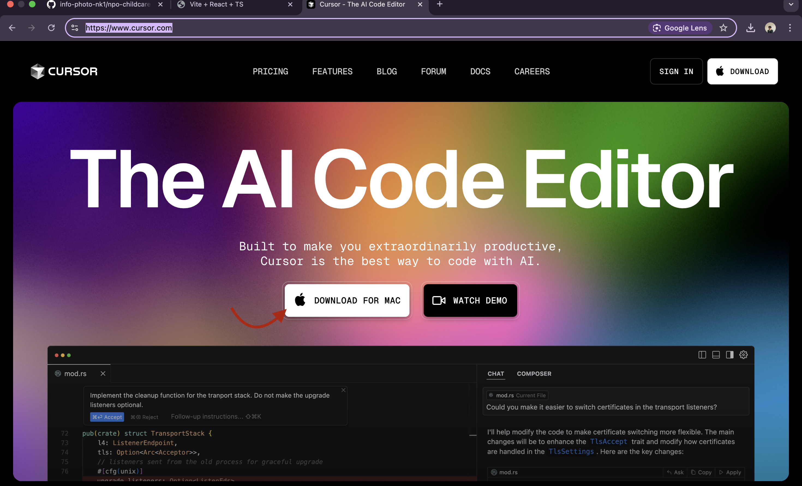
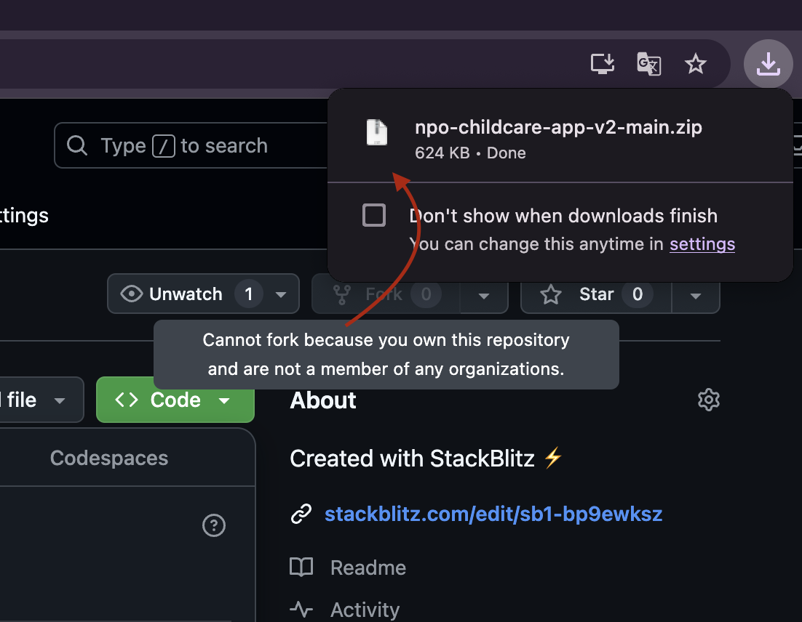
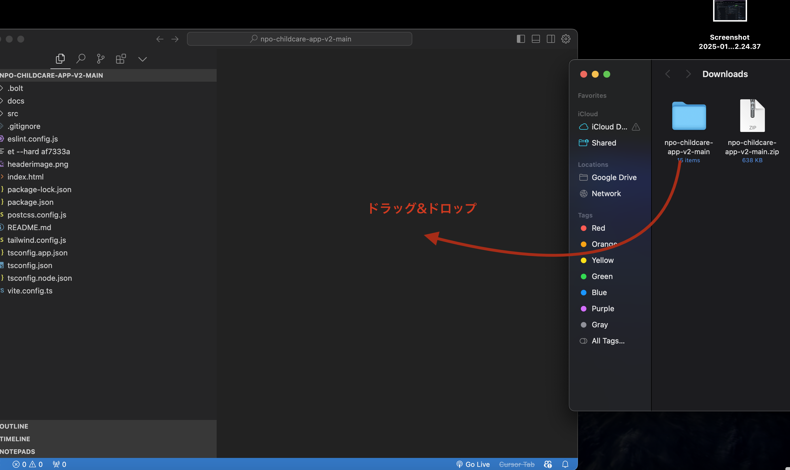
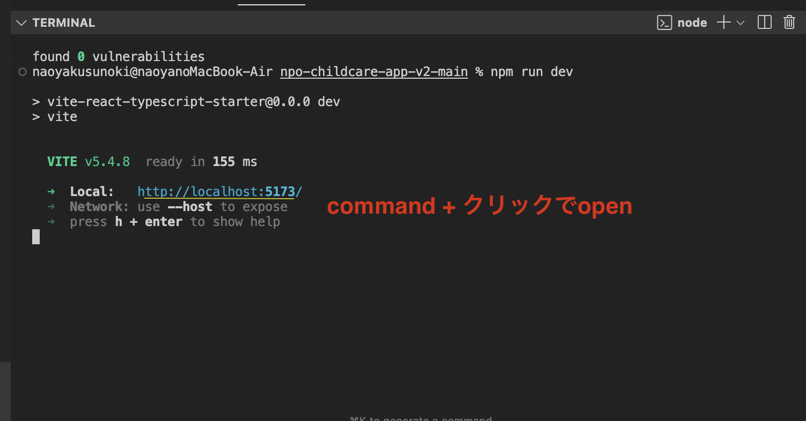
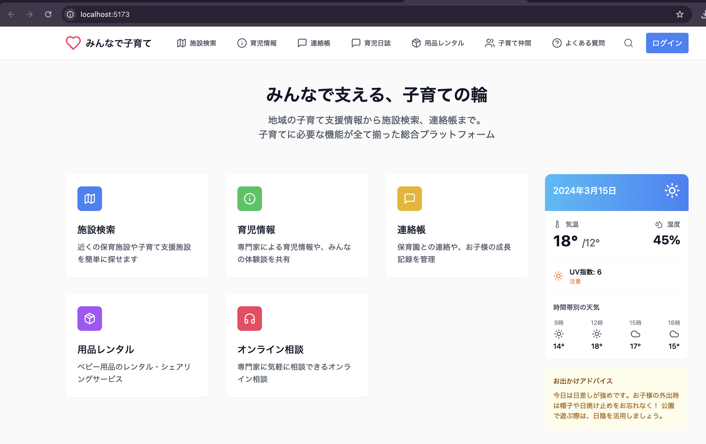
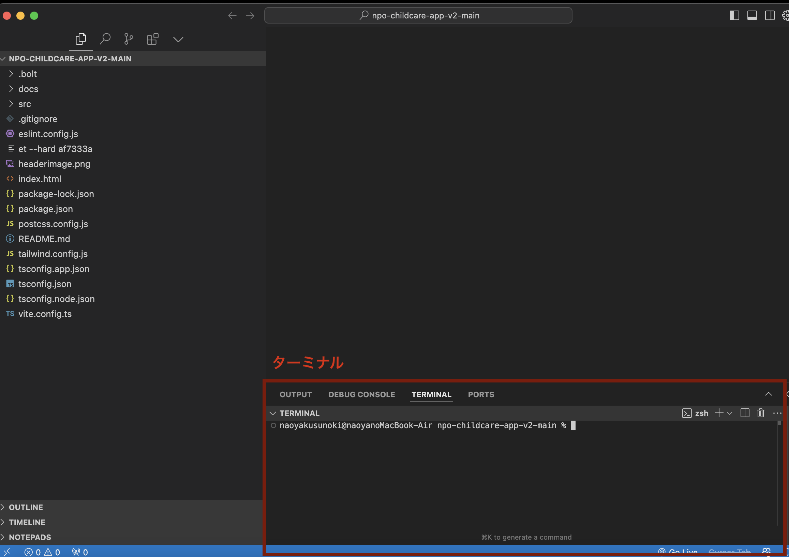
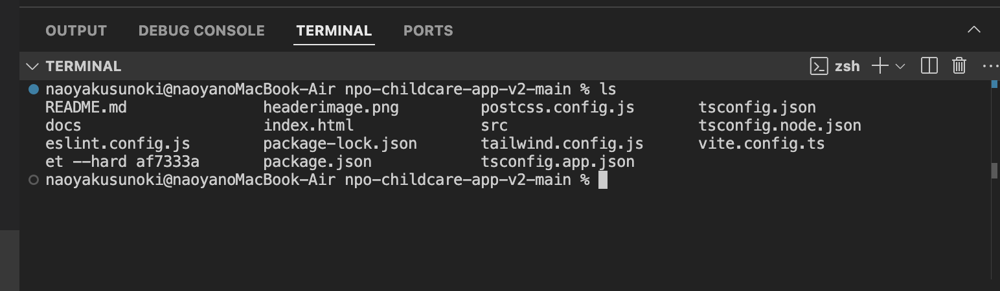
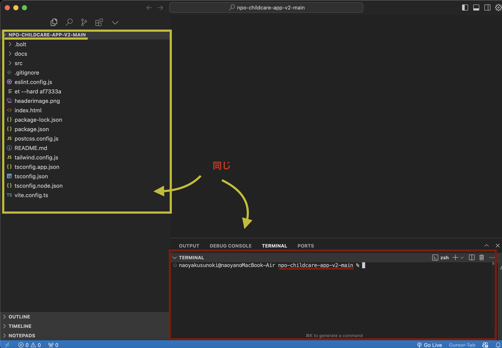

#### 2. Node.js と npm をインストールする
# 地域密着型子育て支援プラットフォーム「みんなで子育て」（仮称）

## プロジェクト概要

### 目的
- 誰でも通園制度の導入に伴い、子育て家庭が抱える情報不足、相談機会の少なさ、周辺サービスの利用不便さを解消する。
- 地域の子育て資源を最大限に活用し、子育て家庭の孤立を防ぎ、地域全体で子育てを支え合う社会の実現に貢献する。
- NPO法人の理念に基づき、子育て家庭に寄り添い、安心・安全な子育て環境を提供する。

### ターゲット
- 未就学児を持つ保護者（特に、一時預かりや短時間保育の利用を検討している保護者）
- 地域の子育て支援施設、保育園・幼稚園
- 地域の子育て支援に関わる専門家、ボランティア

### 提供サービス
- 統合型アプリ（地域密着型マッチング、情報プラットフォーム、保育記録・連絡）
- ベビー用品シェアリングアプリ
- オンライン相談窓口
- ICT導入サポートサービス（将来的に実装の可能性あり）
- 保険・補償サービス（将来的に実装の可能性あり）

## プロジェクト内容

### フェーズ1: アプリ開発（6ヶ月）
- 地域密着型マッチング機能: 地図表示、施設情報掲載、条件検索、予約機能、口コミ機能、自治体連携機能などを開発。AIによるパーソナライズ機能を実装。
- 子育て支援情報プラットフォーム機能: イベント情報、相談窓口情報、医療機関情報、助成金情報などの掲載機能、年齢・テーマ別検索機能、専門家コラム、フォーラム機能、プッシュ通知機能を開発。AIアドバイス機能の実装を検討。
- 保育記録・連絡機能: 連絡帳、写真共有、お知らせ配信、保育日誌記録、成長記録管理、アレルギー情報登録、スケジュール管理、シフト管理機能を開発。有料版の開発も視野に入れ、差別化を図る。
- ベビー用品レンタル・シェアリングアプリ: 商品登録、予約、在庫管理、決済、ユーザー間マッチング機能を開発。安全基準をクリアした高品質な商品を提供。

### フェーズ2: サービス展開（3ヶ月）
- オンライン相談窓口: 相談体制を構築し、相談員を確保（保育士、子育てカウンセラー、専門家など）。予約システム、ビデオ通話システムを導入。
- ICT導入サポートサービス: 保育施設向けのコンサルティング、研修プログラムを開発。保育現場のニーズに合わせたICTツールを選定。事例共有のためのセミナーやワークショップを開催。
- 保険・補償サービス: 保険会社と連携し、サービス内容を決定。契約手続きを簡略化するための仕組みを構築。

### フェーズ3: 運用・改善（継続）
- アプリの利用状況、サービス利用状況を分析し、改善策を実施。
- ユーザーからのフィードバックを収集し、継続的にサービスの質向上を目指す。
- 新たなニーズに対応できるよう、サービス内容の拡充を検討。
- 広報活動を通じて、サービスの認知度向上に努める。

## 収益モデル
- アプリ: 有料版の提供（保育記録・連絡機能）、広告掲載（地域のイベント、企業広告など）
- オンライン相談: 有料相談の提供
- ベビー用品レンタル・シェアリング: シェアリング手数料
- ICT導入サポート: コンサルティング費用、研修費用
- 保険・補償サービス: 保険契約手数料
- 助成金・補助金: 地方自治体や国の助成金・補助金制度の活用
- 企業協賛: 子育て支援に関心のある企業との連携による協賛金

## KPI（重要業績評価指標）
- アプリダウンロード数
- アプリの利用者数
- サービスの利用件数
- オンライン相談の利用件数
- アプリの利用満足度
- サービスの利用満足度
- 口コミ評価
- 会員数
- 収益

## プロジェクトチーム
- プロジェクトリーダー：naoya
- アプリ開発担当：yoshi
- サービス運営担当：hirose,naoya
- 広報担当：hirose

## 地域連携
- 自治体：情報提供、連携窓口
- 子育て支援施設：サービス連携
- 保育園・幼稚園：ICT導入支援
- 地域団体：ボランティア募集、イベント開催

## 今後の課題
- 継続的なサービス改善とバージョンアップ
- 他地域への展開
- NPO法人の組織体制の強化
- データ引き付き機能学校教育との連携

## 🚀 開発者向け：ローカル環境での実行方法

このセクションでは、開発者向けに GitHub からコードをダウンロードしてローカル環境で実行する手順を説明します。

### 💻 前提条件

*   **Git:** コードをダウンロードするために必要です。
*   **Node.js:** JavaScript の実行環境です。npm (Node Package Manager) も一緒にインストールされます。
*   **Visual Studio Code (VS Code):** コードの編集に便利なテキストエディタです。必要ではありませんが、インストールしておくと開発が効率的になります。

### 💻 補足：VS Code のダウンロードと基本的な使い方

VS Code は、コードの編集、デバッグ、Git の操作など、開発に必要な機能が豊富に揃った人気のテキストエディタです。

#### ダウンロード

[cursor の公式サイト](https://www.cursor.com/) から、お使いの OS に合ったインストーラーをダウンロードしてインストールしてください。
    <br>

#### 基本的な使い方

*   **ファイルの開き方:** VS Code を起動後、「ファイル」メニューから「ファイルを開く」または「フォルダーを開く」を選択し、プロジェクトのファイルまたはフォルダーを開きます。
*   **ターミナルの開き方:** VS Code の上部メニューから「ターミナル」>「新しいターミナル」を選択すると、VS Code 内でターミナルを開くことができます。
*   **拡張機能:** VS Code の機能を拡張するために、さまざまな拡張機能をインストールできます。左側のサイドバーにある拡張機能アイコンをクリックし、検索バーにキーワードを入力して目的の拡張機能を検索し、インストールします。

### ⚙️ ローカル環境構築手順

#### 1. リポジトリをクローンまたはダウンロードする

** ZIP ファイルをダウンロードする**

Git を使用しない場合は、GitHub から ZIP ファイルをダウンロードして展開することもできます。

1. このプロジェクトの GitHub リポジトリにアクセスします。
2. 緑色の「Code」ボタンをクリックし、「Download ZIP」を選択してファイルをダウンロードします。  
    <br>
3. ダウンロードが完了したら、ZIP ファイルを任意の場所に展開します。<br>
    <br>
4. ZIP ファイルをダブルクリックで展開したら、Cursor を開いてフォルダ（ディレクトリと同義）を開いてください。そこにフォルダをドラッグ＆ドロップすると、プロジェクトファイルが Cursor 上で開きます。<br>
    <br>

#### 2. Node.js と npm をインストールする

次に、JavaScript の実行環境である Node.js と、パッケージ管理ツールの npm をインストールします。

**Windows:**

1. [Node.js の公式サイト](https://nodejs.org/) から LTS 版をダウンロードしてインストールしてください。Node.js には npm (Node Package Manager) が含まれています。
2. インストール後、**Git Bash** を起動し、以下のコマンドで Node.js と npm が正しくインストールされたか確認します。

```bash
node -v
npm -v
```

**macOS:**

Homebrew を使用して Node.js をインストールできます。ターミナルを開き、以下のコマンドを実行します。

```bash
brew install node
```

インストール後、以下のコマンドで Node.js と npm が正しくインストールされたか確認します。

```bash
node -v
npm -v
```

**Linux:**

apt (Debian, Ubuntu) や yum (CentOS, Fedora) などのパッケージマネージャーを使用して Node.js をインストールできます。

**Debian/Ubuntu:**

```bash
sudo apt update
sudo apt install nodejs npm
```

**CentOS/Fedora:**

```bash
sudo yum install nodejs npm
```

インストール後、以下のコマンドで Node.js と npm が正しくインストールされたか確認します。

```bash
node -v
npm -v
```

#### 3. プロジェクトの依存関係をインストールする

ターミナルでプロジェクトのルートディレクトリに移動し、以下のコマンドを実行して、`package.json` ファイルに記載されている依存関係をインストールします。

```bash
npm install
```


#### 4. 開発サーバーを起動する

依存関係のインストールが完了したら、以下のコマンドを実行して開発サーバーを起動します。

```bash
npm run dev
```


このコマンドを実行すると、ローカル開発サーバーが起動し、ブラウザでアプリケーションにアクセスするための URL が表示されます。通常は `http://localhost:3000` のようなアドレスです。



ブラウザで表示された URL にアクセスすると、アプリケーションが実行されていることを確認できます。



### 📂 プロジェクトのファイル構成

プロジェクトの主要なファイルとディレクトリ構成は以下の通りです。

```
npo-childcare-app-v2/
├── public/                  # 静的アセット (画像、フォントなど)
├── src/                     # アプリケーションのソースコード
│   ├── components/          # React コンポーネント
│   ├── pages/               # ページコンポーネント
│   ├── styles/              # スタイルシート
│   ├── assets/              # アプリケーション固有のアセット
│   ├── App.tsx              # メインのアプリケーションコンポーネント
│   ├── index.tsx            # エントリーポイント
│   └── ...
├── package.json           # プロジェクトの依存関係とスクリプト
├── README.md              # プロジェクトの説明
├── tsconfig.json          # TypeScript の設定
└── ...
```

### ターミナルの操作

*   **ターミナルの表示:**  VS Code の上部メニューから「表示」>「ターミナル」を選択するか、`Ctrl + Shift + \``  (Windows/Linux) または `Cmd + Shift + \`` (macOS) を押すと、ターミナルを表示できます。
    

*   **コマンドの実行:** ターミナル内で、さまざまなコマンドを実行できます。例えば、ディレクトリの内容を表示するには `ls` コマンドを使用します。
    

*   **ディレクトリの移動:** `cd` コマンドを使用して、ディレクトリ間を移動できます。
    

### ✅  npm audit fix の実行について

`npm audit fix` は、プロジェクトの依存関係における既知のセキュリティ脆弱性を自動的に修正しようとするコマンドです。


このコマンドを実行すると、`package.json` ファイルと `package-lock.json` ファイルが更新され、脆弱性のあるパッケージが安全なバージョンに置き換えられます。ただし、場合によっては、依存関係の更新によって予期しない問題が発生する可能性があるため、注意が必要です。

### 📚 参考情報

*   **Git:** [https://git-scm.com/](https://git-scm.com/)
*   **Node.js:** [https://nodejs.org/](https://nodejs.org/)
*   **npm:** [https://www.npmjs.com/](https://www.npmjs.com/)
*   **Visual Studio Code:** [https://code.visualstudio.com/](https://code.visualstudio.com/)
*   **cursor:** [https://www.cursor.com/](https://www.cursor.com/)

このドキュメントが、ローカル環境での開発のセットアップに役立つことを願っています。
